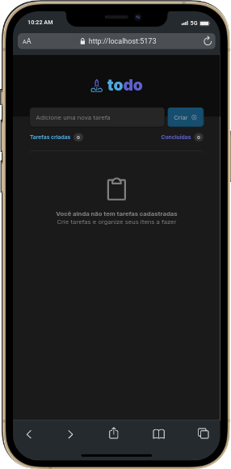

# ToDo Rocket 🚀 

[Confira Aqui ⚡](https://doug-todo.vercel.app/) 

### 
📝 ToDo Rocket é uma aplicação de controle de tarefas, que permite ao usuário:
  * Adicionar uma nova tarefa
  * Marcar e desmarcar uma tarefa como concluída
  * Remover uma tarefa da listagem
  * Mostrar o progresso de conclusão das tarefas

  

  

### 
⚡ O projeto foi desenvolvido utilizando:
  
  
  
  
  
  
  

### 
💡 Foram trabalhados conceitos fundamentais do desenvolvimento com React:
  * Estado
  * Imultabilidade do Estado
  * Lista e Chaves 
  * Propriedades 
  * Componentização

